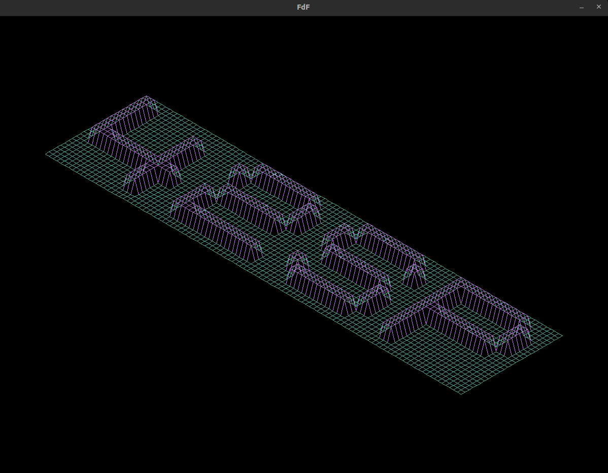
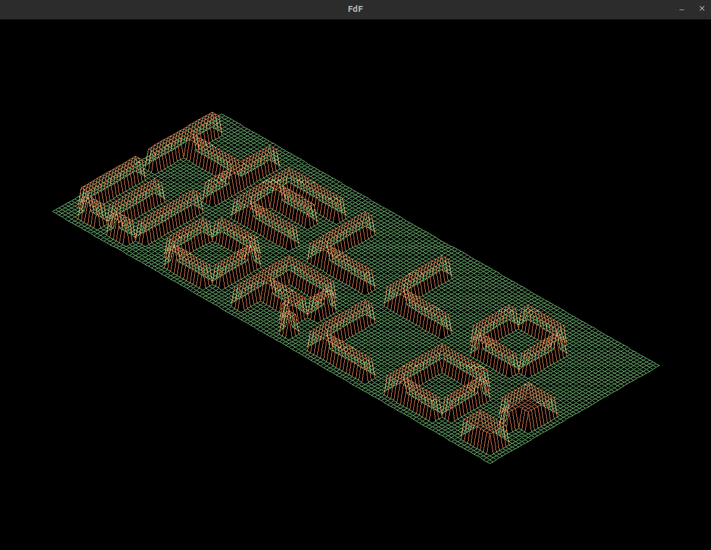
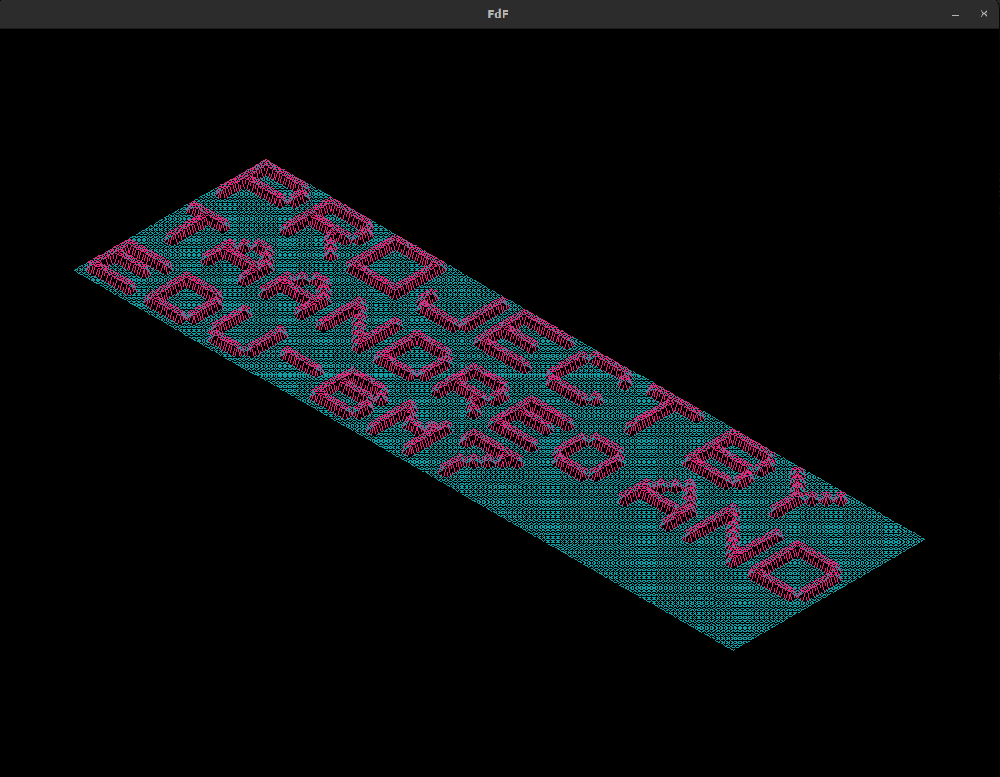

# FdFGen
This is a CLI program that takes your message as an argument and transforms into FdF maps to show in your project.

### Table of Contents

1. [Installation](#installation)
2. [Usage](#usage)
3. [Examples](#examples)
4. [License](#license)

## Installation

You can download the latest binary from
[here](https://github.com/taandreo/fdfgen/releases), or you can compile from
source:

```bash
go install github.com/taandreo/fdfgen@latest
```

## Usage

To use the program there is 2 mandatory flags: the message `-msg` and the name of the map `-map`.
You are free to name the map, you usually want it with .fdf extension for the FdF project:

```
./fdfgen -msg "42SP" -map example.fdf
```

You can set the background `-bg` and foreground `-fg` color using 6 digits hexadecimal notation with 0x Prefix, 
```
./fdfgen -msg "42SP" -map example.fdf -bg 0xFF0000 -fg 0x00FF00
```

You can choose the height of the map (The Z axis on FdF project) with the `-height` flag(default is 3):
```
./fdfgen -msg "42SP" -map example.fdf -bg 0xFF0000 -fg 0x00FF00 -height 5
```

If your message is too long, you can choose the maximum number of words will be in a line with the `-w` flag:
```
./fdfgen -msg "42SP" -map example.fdf -bg 0xFF0000 -fg 0x00FF00 -height 5 -w 3
```

The `-p` flag takes no arguments and it is useful if you want to preview your message in the terminal, before you create your map:
**Note:** the background color, foreground color and height are meaningless in the terminal.  
```
./fdfgen -msg "42SP" -map example.fdf -w 3 -p
```

## Examples

---

`./fdfgen -msg "Hello World!" -w 1 -map example.fdf -fg 0xba77db -bg 0x54ac97`



---

`./fdfgen -msg "Hello World!" -w 1 -map example.fdf -fg 0xEF8354 -bg 0x7DCE82 -height 5`



---

`./fdfgen -msg "PROJECT BY taandreo AND edu-bm7" -w 2 -map example.fdf -fg 0xed217c -bg 0x119da4`



