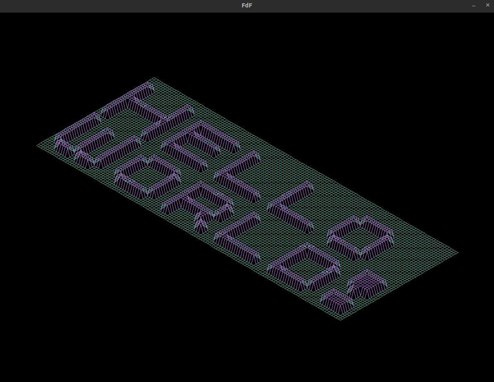
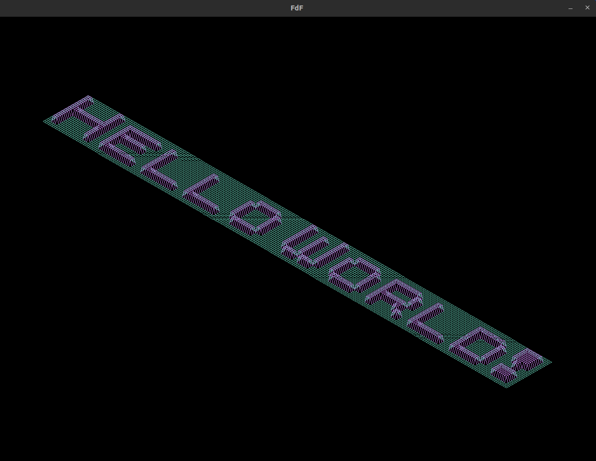

- This is a program that takes your message as argument and transforms into FdF maps to show in your project.

## Exemples

---

`./main -msg "Hello World!" -w 1 -map test.fdf -fg 0xba77db -bg 0x54ac97`

---

`./main -msg "Hello World!" -w 1 -map test.fdf -fg 0xEF8354 -bg 0x7DCE82 -height 5`

---

`./main -msg "Hello World!" -map test.fdf -fg 0xba77db -bg 0x54ac97`

